# 🐶🐱 **KNN Cat vs Dog — From Scratch Image Classification Experiment**

<p align="center">
  
  
  
  
</p>

<p align="center">
  <b>Understanding KNN with Real Images — Noise, Distance, Neighbors, and the Curse of Dimensionality</b>
</p>

---

## 🚀 **Introduction**

This project is a **from-scratch implementation of K-Nearest Neighbors (KNN)** applied to real-world **cat vs dog image classification**.

> 🎯 **The mission:**  
> *Not to chase accuracy — but to understand why models behave the way they do.*

We convert images into numerical vectors, compute distances, and let **geometry decide the class** using **majority voting**.

Along the way, we expose:
- Data quality issues  
- Sensitivity to `K`  
- Noise & overfitting  
- The curse of dimensionality  

---

## 🧠 **How It Works**

### 🔄 **Classification Pipeline**

```mermaid
graph LR
    A[🖼️ Image] --> B[📊 Vector]
    B --> C[📐 Distance]
    C --> D[👥 Neighbors]
    D --> E[🗳️ Vote]
    E --> F[🧾 Prediction]
```


---

## 🧪 **The Experiment**

⚡ **Shocking observation:**  
Removing just **5 images from each class** dramatically improved prediction accuracy.

### Why?

Because in high-dimensional space:

- A few noisy samples can completely distort distance geometry  
- KNN has no concept of abstraction  
- All mistakes are baked directly into the model  

This project makes that behavior **visible and intuitive**.

---

## 📂 **Folder Structure**
```bash
KNN-Cat-vs-Dog/
│
├── data/
│   ├── train/
│   │   ├── cats/
│   │   └── dogs/
│   └── test/
│       └── sample.jpg
│
├── knn.py
├── vectorizer.py
├── distance.py
├── experiment.ipynb
├── result.jpg   # 📸 Results Screenshot
└── README.md

```

---

## ▶️ **Run Instructions**

```bash
pip install -r requirements.txt
python knn.py --k 5 --image data/test/sample.jpg
Try changing k:
python knn.py --k 3 --image data/test/sample.jpg
python knn.py --k 7 --image data/test/sample.jpg


Observe how the prediction changes with geometry.
```
## 🧾 **Results**

<p align="center">
  
</p>

🧪 *Placeholder for experimental results screenshot*

---

## 🧩 **Key Learnings**

💡 This project teaches concepts most courses never show clearly:

- KNN is entirely data-driven  
- Distance metrics define intelligence  
- More data ≠ better model  
- Noise is more dangerous than small datasets  
- High-dimensional space behaves unintuitively  

---

## ⚠️ **Why KNN Fails at Scale**

| Problem | Explanation |
|-------|-------------|
| Curse of Dimensionality | Distance loses meaning in high dimensions |
| Memory Heavy | Stores entire dataset |
| Slow Prediction | Must compute distance to all points |
| Noise Sensitive | Outliers dominate decisions |
| No Feature Learning | No abstraction or hierarchy |

---

## 🔮 **Future Improvements**

- PCA & dimensionality reduction  
- Feature extraction with CNN embeddings  
- KD-Trees & Ball Trees for faster search  
- Weighted KNN  
- Interactive visualization of neighbors  

---

## 🧑‍💻 **For Beginners & Recruiters**

🧭 This project demonstrates deep conceptual understanding, not just library usage.

It proves the ability to:

- Implement ML from scratch  
- Design controlled experiments  
- Explain model behavior  
- Understand theoretical limitations  

---

## 🏁 **Final Note**

🧠 *Before neural networks learn to see,*  
*you must understand how distance learns to lie.*

⭐ **Star the repo** if it helped you see machine learning differently.
